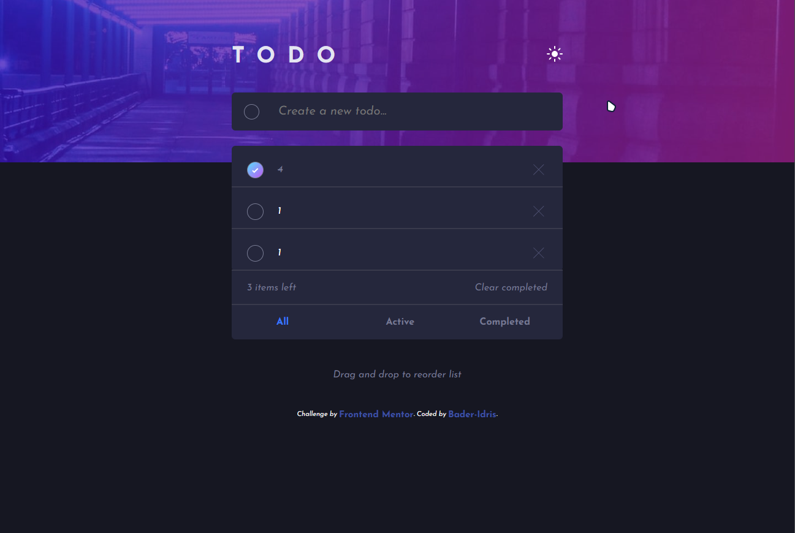
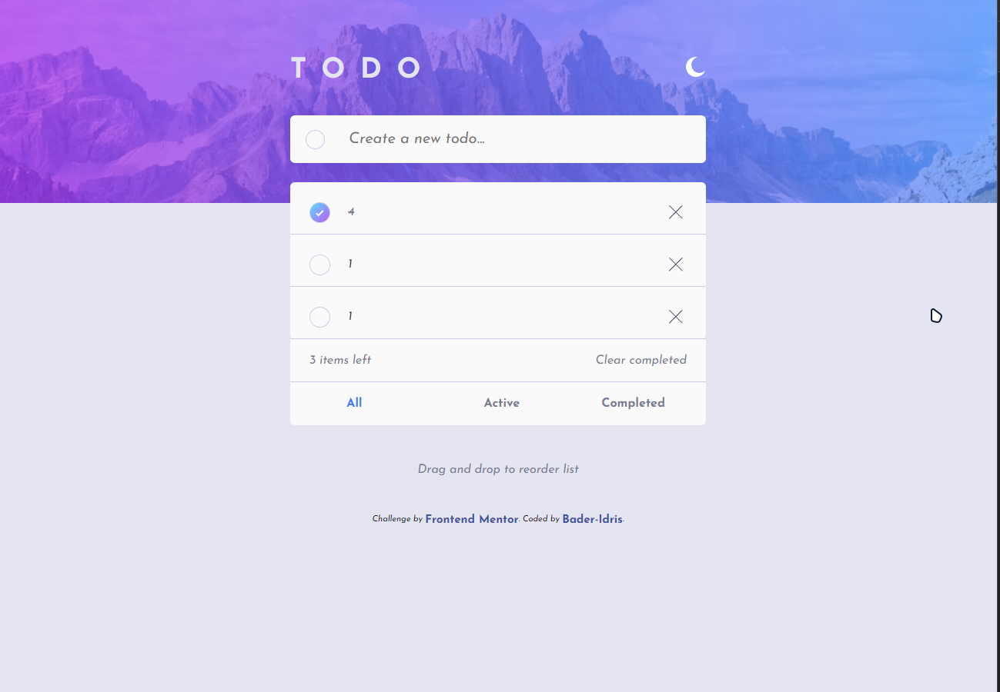
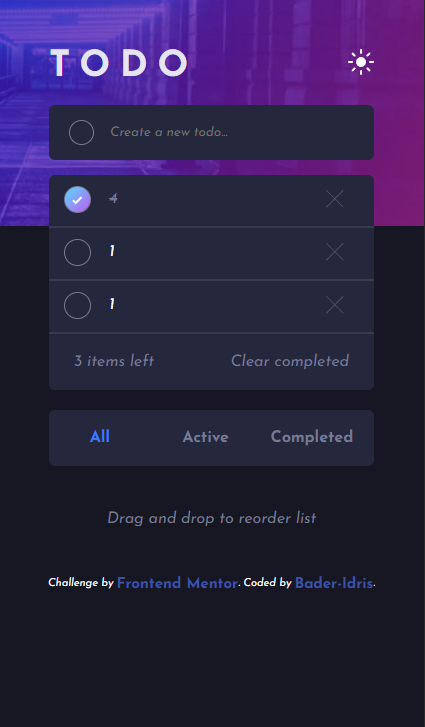
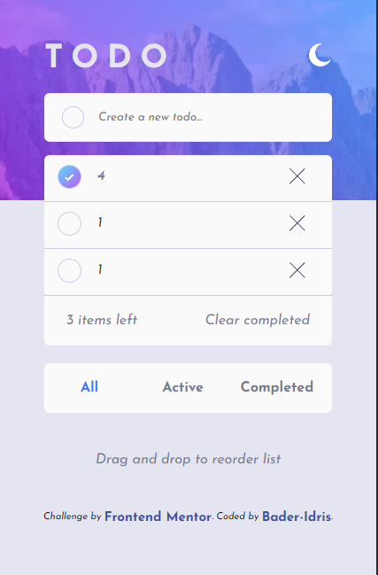

# Frontend Mentor - Todo app solution

This is a solution to the [Todo app challenge on Frontend Mentor](https://www.frontendmentor.io/challenges/todo-app-Su1_KokOW).

## Table of contents

- [Overview](#overview)
  - [Screenshot](#screenshots)
  - [Links](#links)
- [My process](#my-process)
  - [Built with](#built-with)
  - [Continued development](#continued-development)
  - [Useful resources](#useful-resources)
- [Author](#author)
- [Acknowledgments](#acknowledgments)

## Overview

Users are able to:

### **big advantage:** exit the page and re-open it without losing their `todo list data`

- View the optimal layout for the app depending on their device's screen size
- See hover states for all interactive elements on the page
- Add new todos to the list
- Mark todos as complete
- Delete todos from the list
- Filter by all/active/complete todos
- Clear all completed todos
- Toggle light and dark mode

### Screenshots

### Links

- Solution URL: [check solution in front-end mentor site]([https://your-solution-url.com](https://www.frontendmentor.io/solutions/todo-app-with-localstorage-F2xrnnhNsC))
- Live Site URL: [check it out](https://bader-idris.github.io/todo-app/)

## My process

### Built with

- Semantic HTML5 markup
- CSS custom properties
- Flexbox
- Mobile-first workflow
- Vanilla JavaScript
- JS localStorage
- JSON

### Continued development

Tended to Convert it into an Android Application

### Useful resources

- [main school: Elzero Web School](https://elzero.org) - This helped me for connecting localStorage functions. I really liked this Website, and I advise Arabian Developers using it and learning from its Teacher *Osama Mohamed* forward.
## Author

- Contact me at Telegram - [Bader Idris](https://t.me/BaderIdrees)
- Frontend Mentor - [@Bader-Idris](https://www.frontendmentor.io/profile/Bader-Idris)

## Acknowledgments

My Great Teacher Osama Mohamed was the biggest support for learning everything in HTML, CSS, and JavaScript to me
